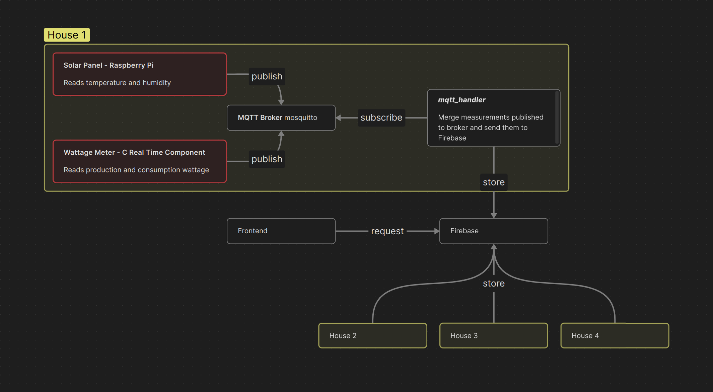
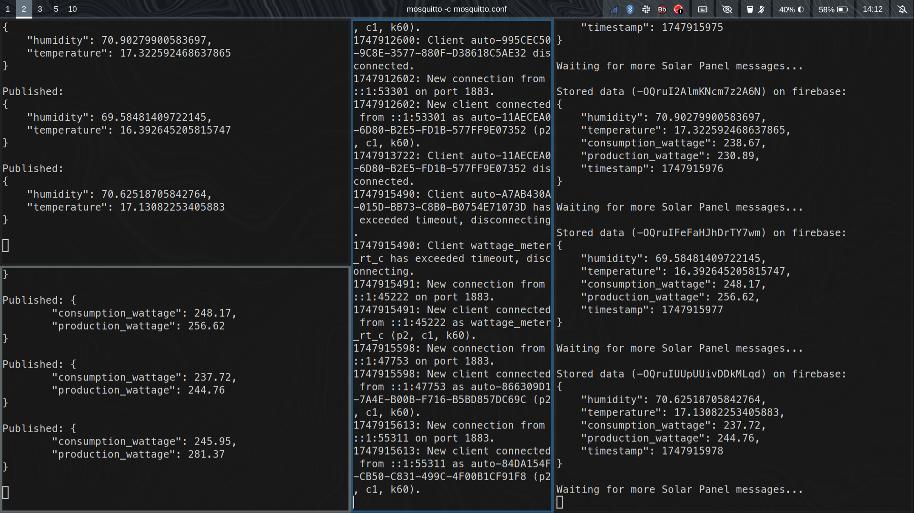
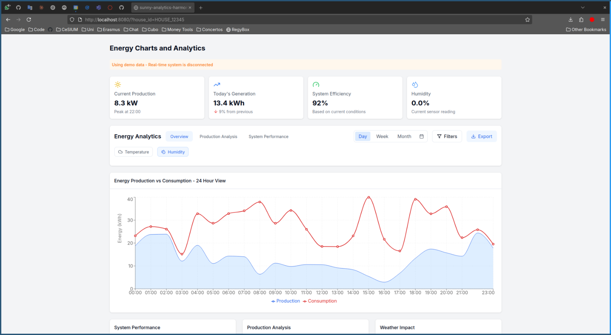

<!-- PROJECT LOGO -->
<br />
<div align="center">
  <h3 align="center">Trivial Sun</h3>

  <p align="center">
    Real Time Solar Panel Monitoring System
    <br />
    <br />
    <a href="#-demo">View Demo</a>
    &middot;
    <a href="#-getting-started-with-development">Start Developing</a>
  </p>

<h4 align="center">
⭐ Don't forget to Starring ⭐
</h4>

  <div align="center">

[![C][C-badge]][C-url]
[![Python][Python-badge]][Python-url]
[![React.js][React.js-badge]][React-url]

  </div>

  <div align="center">

![University][university-badge]
![Subject][subject-badge]
![Grade][grade-badge]

  </div>
</div>


<!-- TABLE OF CONTENTS -->
<details>
  <summary>📋 Table of Contents</summary>

## 📋 Table of Contents

- [About The Project](#-about-the-project)
- [Getting Started with Development](#-getting-started-with-development)
- [Contributing](#-contributing)
- [Developed by](#-developed-by)
</details>


## 🔍 About The Project

### 🎯 The goal

The goal of this project was to create a system for real-time monitoring of environmental and electrical data related to solar energy production. A Raspberry Pi equipped with a Sense HAT was used to collect local weather data on the solar panel and, in parallel, a real-time component written in C simulate measurements from the household electrical panel (power consumption and solar panel production). 

### ⚙️ How it works?

The architecture of the application is divided into two main layers: the *House layer* and the *Global layer*.

In the *House layer*, each household is equipped with a solar panel installation and a corresponding Raspberry Pi unit, referred to as the `Solar Panel - Raspberry Pi`. This device collects the temperature and humidity near the solar panel using the Sense HAT. Additionally, a Real Time C component, named `Wattage Meter - C Real Time Component`, simulates that reads data from the household’s electrical panel, specifically the home’s power consumption and solar energy production. Both devices publish their data to a local MQTT broker under the appropriated topics. A dedicated component within the house, the `mqtt_handler`, is responsible for subscribing to these MQTT topics, aggregating the incoming data, and pushing it to a centralized Firebase database.

The *Global layer* consists of a single Firebase database instance that receives and stores data from all homes using the system. This centralized data storage allows for consistent and scalable access to information across multiple installations. The data in Firebase is then accessed through a frontend interface, which provides users with real-time insights into their energy consumption and solar panel performance, as well as allowing them to verify whether the production levels are consistent with the current weather conditions.




### 🎬 Demo





### 🧩 Features

- Real-time environmental monitoring (temperature and humidity) using Raspberry Pi and Sense HAT
- MQTT-based communication for reliable data transmission
- Centralized Firebase database for multi-house data storage
- Interactive React frontend with time-series visualizations
- Scalable architecture supporting multiple households


## 🚀 Getting Started with Development

To a quick setup is recommended run all the components on the same machine, since the default Broker IP address is set to `localhost`, but all the components accept the broker IP and port as parameter, to a more realistic setup.

Is possible replicate the full Solar Panel Monitoring System following these steps.

### 1. Prerequisites

This project depends Mosquitto MQTT Broker (including client and developer libraries) and Node.js environment to the frontend.

Install Mosquitto [client](https://mosquitto.org/download) and [developer library](https://mosquitto.org/man/libmosquitto-3.html):

```bash
# Debian/Ubuntu
$ sudo apt install mosquitto libmosquitto-dev

# Arch Linux
$ sudo pacman -S mosquitto
```

Install `Node.js` and `npm` through the [official documentation](https://nodejs.org/en/download).


### 2. Cloning

Now clone the repository to your local machine. You can do this using Git:

```bash
$ git clone git@github.com:darguima/Trivial-Sun-ERTS.git
# or
$ git clone https://github.com/darguima/Trivial-Sun-ERTS.git
```

### 3. Python Environment

Creates a Python environment.

```bash
$ python -m venv .venv
$ source .venv/bin/activate # run this in every new terminal session
```

### 4. Dependencies

Install Python libraries:

```bash
$ pip install -r requirements.txt
```

### 4. Start components

#### 4.1. Mosquitto Broker

The first component to be initialized is the Mosquitto MQTT broker.

```bash
$ mosquitto -c mosquitto.conf
```

#### 4.2. Meters

Start Solar Panel - Raspberry Pi:

```bash
$ python solar_panel_rpi.py

# or if you want to specify MQTT address
$ python solar_panel_rpi.py [broker IP] [port]
```

Start Wattage Meter - C Real Time Component

```bash
$ gcc wattage_meter_rt_c_component.c -o wattage_meter_rt_c_component -lm -lmosquitto
$ ./wattage_meter_rt_c_component

# or if you want to specify MQTT address
$ ./wattage_meter_rt_c_component [broker IP] [port]
```

#### 4.3. MQTT handler

The final piece of the project is the MQTT Handler. This script requires as a parameter a unique identifier per house.

Is possible update the Firebase database updating the variable `FIREBASE_URL`.

```bash
$ python mqtt_handler.py <house_id>

# example usage
$ python mqtt_handler.py HOUSE_123

# or if you want to specify MQTT address
$ python mqtt_handler.py <house_id> [broker IP] [port] # optional: to specify MQTT address
```

After completing these steps, the system will be fully operational, with synchronized and time-consistent sensor data being pushed to Firebase for each registered house.

#### 4.4. Frontend

To launch the frontend interface, navigate to the frontend-dis directory, install the necessary dependencies, and start the development server:

```bash
$ cd frontend-dis
$ npm i
$ npm run dev
```

Once the server is running, you can access the user interface by visiting the following URL in your browser `http://localhost:8080/?house_id=<HOUSE_ID>`. Note that the HOUSE_ID should be the same used on the `mqtt_handler.py`.


## 🤝 Contributing

Contributions are what make the open source community such an amazing place to learn, inspire, and create. Any contributions you make are **greatly appreciated**.

If you have a suggestion that would make this better, please fork the repo and create a pull request. You can also simply open an issue with the tag "enhancement".
Don't forget to give the project a star! Thanks again!

1. Fork the Project
2. Create your Feature Branch (`git checkout -b feature/AmazingFeature`)
3. Commit your Changes (`git commit -m 'Add some AmazingFeature'`)
4. Push to the Branch (`git push origin feature/AmazingFeature`)
5. Open a Pull Request


## 👨‍💻 Developed by

- [Darguima](https://github.com/darguima)
- [Joseph Koyi](https://github.com/2001J)


<!-- MARKDOWN LINKS & IMAGES -->
<!-- https://www.markdownguide.org/basic-syntax/#reference-style-links -->
[university-badge]: https://img.shields.io/badge/University-ELTE-red?style=for-the-badge
[subject-badge]: https://img.shields.io/badge/Subject-ERTS-blue?style=for-the-badge
[grade-badge]: https://img.shields.io/badge/Grade-[UNI_GRADE]%2F20-brightgreen?style=for-the-badge

[React.js-badge]: https://img.shields.io/badge/React-20232A?style=for-the-badge&logo=react&logoColor=61DAFB
[React-url]: https://reactjs.org/

[Python-badge]: https://img.shields.io/badge/Python-3776AB?style=for-the-badge&logo=python&logoColor=white  
[Python-url]: https://www.python.org/

[C-badge]: https://img.shields.io/badge/C-00599C?style=for-the-badge&logo=c&logoColor=white  
[C-url]: https://en.wikipedia.org/wiki/C_(programming_language)
